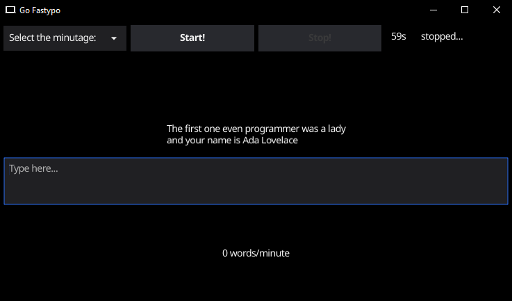

<h1 align="center">
  <br>
  
  <br>
 Gofastypo
  <br>
</h1>

Typing test and benchmarking.
This a desktop application is a very minimal clone of [typingtest](http://typingtest.com) web application, built with **Golang**.

_A pretty screenshot of the application:_


#

To clone and run this application, you'll need [Git](https://git-scm.com) and [Golang](https://go.dev/learn/) and the [Docker](https://www.docker.com/) to run the app in container

```bash
# Clone this repository
$ git clone https://github.com/Leoff00/go-diego-bot.git

# Go into the repository
$ cd gofastypo

# Run the project locally
$ go run main.go

# Or if you want to compile
$ go build

# Or
$ chmod +x ./build.sh
```

## Credits

This software uses the following open source packages:

- [Golang-stdlibs](https://pkg.go.dev/std)
- [Fyne toolkit](https://developer.fyne.io/started/)
